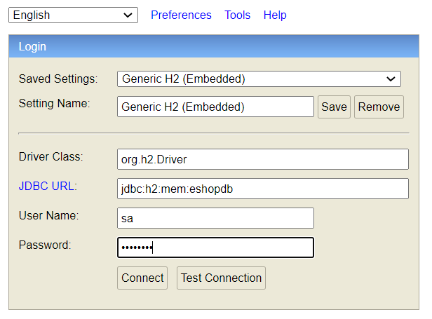

# Simple spring boot rest application (watches-eshop)
This is simple rest spring boot application with:
  * h2 database
  * spring data
  * model mapper
  * validation with return object error validation
  * rest api
    
consist of two endpoints:
  * Create new stock item for watches
    * Http method: Post
    * url: http://localhost:8080/stockItems/watches 
    * Content types: json, xml
    * Accept types: json, xml
    * Example request (json input and output): 
    ```
      curl --request POST \
          --url http://localhost:8080/stockItems/watches \
          --header 'Accept: application/json' \
          --header 'Content-Type: application/json' \
          --data '{
              "title": "Prim",
              "price": "123",
              "description": "This is a long watch description.",
              "image": "iVBORw0KGgoAAAANSUhEUgAAAAEAAAABCAYAAAAfFcSJAAAADUlEQVR42mNkSPxfDwADqgHh5Lh3ywAAAABJRU5ErkJggg=="
          }'
    ```
    * Example response validation error:
      ```
      {
        "timestamp": "2020-12-13T15:29:05.766+00:00",
        "message": "Validation failed",
        "validationErrors": [
            {
                "field": "price",
                "code": "NotNull",
                "objectName": "createWatchRequestModel",
                "message": "Price cannot be null"
            }
        ]
      }
      ```
  * Get watches stock item by id
    * Http method: Get
    * url: http://localhost:8080/stockItems/watches/{watchId} 
    * Accept types: json, xml
    * Example request for item id 1 json format output:
    ```
    curl --request GET \
        --url http://localhost:8080/stockItems/watches/1 \
        --header 'Accept: application/json'
    ```


## Build and run
  * ```mvnw clean install```
  * ```mvnw spring-boot:run```

Application run on **8080** tcp port.

## Database console
  * Url: http://localhost:8080/h2-console
  
Acces data to database:
  * Name of database: eshopdb
  * User name: sa
  * Password: password



### Example other requests
Xml output:
```
curl --request GET \
    --url http://localhost:8080/stockItems/watches/1 \
    --header 'Accept: application/xml'
```

  
